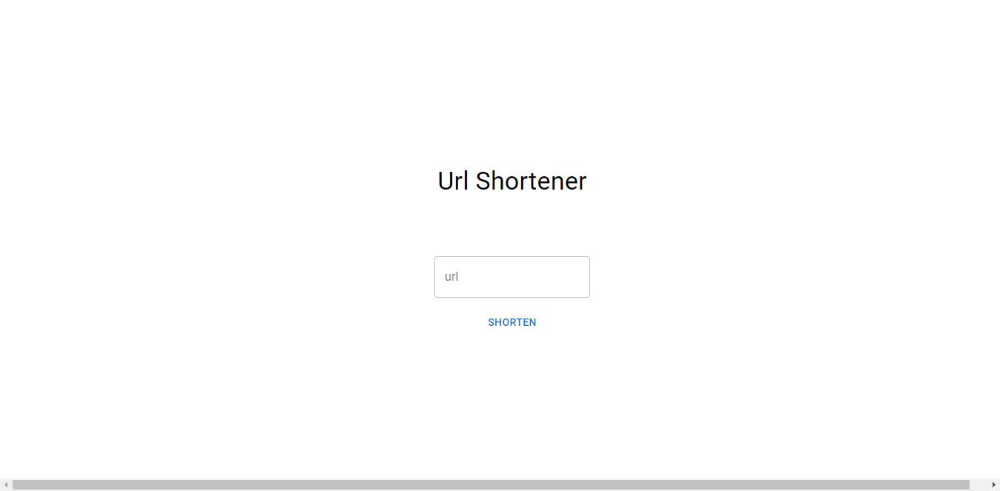

# URL Shortener App



A URL Shortener App built with Next.js, TypeScript, and the Bitly API. This application allows users to shorten long URLs into concise, easy-to-share links.

## Features

- Shorten any long URL into a compact, shortened link.
- Copy the shortened link to the clipboard with a single click.

## Installation

Before running the app, make sure you have the following prerequisites:

- Node.js (version 18 or above)
- Bitly API access token (sign up for a free account at [Bitly](https://bitly.com))

Follow these steps to set up and run the app:

1. Clone the repository:

   ```bash
   git clone https://github.com/dennis-carrozzo/url-shortener.git
   ```

2. Navigate to the project directory:

   ```bash
   cd url-shortener
   ```

3. Install the dependencies:

   ```bash
   npm install
   ```

4. Create a `.env.local` file in the project root directory and add your Bitly API access token:

   ```
   BITLY_API_TOKEN=YOUR_BITLY_API_TOKEN
   BITLY_API_URL=https://api-ssl.bitly.com/v4/shorten
   ```

5. Start the development server:

   ```bash
   npm run dev
   ```

6. Open your browser and visit [http://localhost:3000](http://localhost:3000) to access the URL Shortener App.

## Usage

1. Enter the long URL you want to shorten in the input field.
2. Click the "Shorten" button to generate a shortened link.
3. Copy the shortened link by clicking the generated Link Box.

## Technologies Used

- Next.js: A React framework for server-side rendering and static site generation.
- TypeScript: A typed superset of JavaScript that provides improved tooling and scalability.
- Bitly API: A URL shortening service that provides APIs for generating and managing shortened links.

## Contributing

Contributions to the URL Shortener App are welcome! If you have any suggestions, bug reports, or feature requests, please open an issue or submit a pull request.

Before contributing, please review the [CONTRIBUTING.md](CONTRIBUTING.md) file for guidelines on how to get started.

## License

This project is licensed under the [MIT License](LICENSE).
